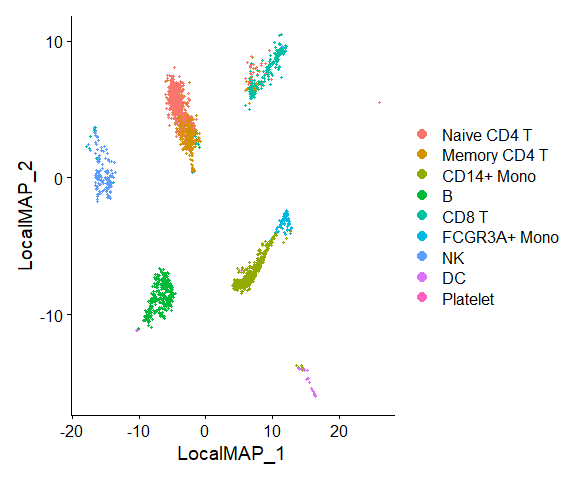
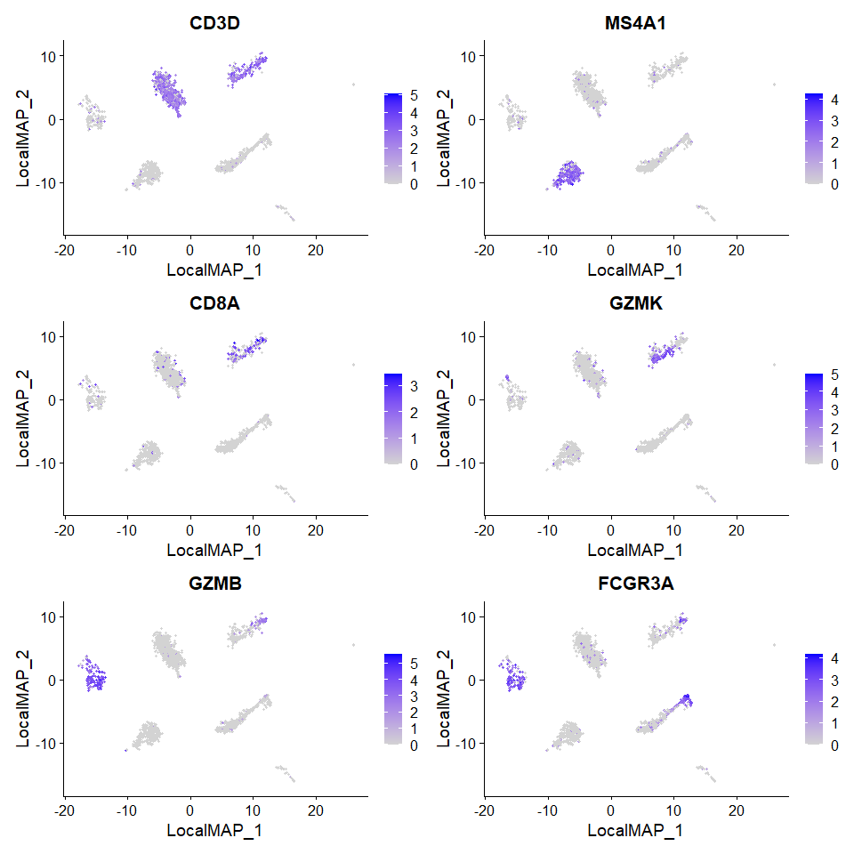
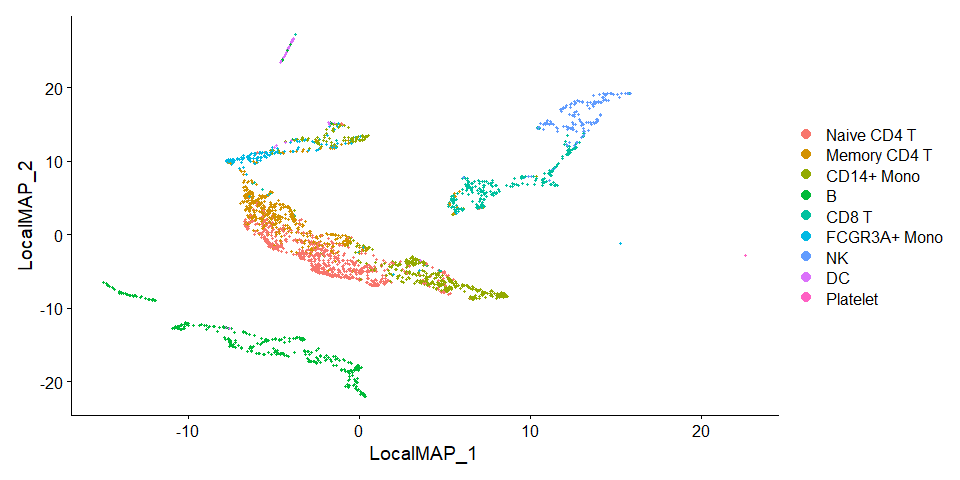

Running LocalMAP on a Seurat Object
================
Compiled: July 29, 2026

This vignette demonstrates how to run **LocalMAP** on a Seurat object.
LocalMAP is a variant of PaCMAP that adds a local graph-adjustment stage
in phase 3: further-pair partners are resampled to points that are
already close in the low-dimensional embedding (within
`low_dist_thres`), and the nearest-neighbour gradient term is scaled by
`low_dist_thres / (2 * sqrt(d_ij))`. Compared with base PaCMAP this
tightens local structure while retaining the same global scaffold.

If you use LocalMAP, please cite:

> *Dimension Reduction with Locally Adjusted Graphs*
>
> Yingfan Wang, Yiyang Sun, Haiyang Huang and Cynthia Rudin
>
> Preprint, 2024
>
> GitHub: <https://github.com/YingfanWang/PaCMAP>

and the original PaCMAP references linked from the [PaCMAP
vignette](pacmap.Rmd).

## Prerequisites

- [Seurat](https://satijalab.org/seurat/install)
- [SeuratWrappers](https://github.com/satijalab/seurat-wrappers)
- [SeuratData](https://github.com/satijalab/seurat-data)
- [pacmapr](https://github.com/williamsyy/pacmap-for-R) — native R +
  Rcpp implementation of PaCMAP and LocalMAP.

To install `pacmapr` directly:

``` r
# install.packages("remotes")
remotes::install_github("williamsyy/pacmap-for-R", subdir = "pacmapr")
```

No Python, conda, or `reticulate` installation is required.

``` r
library(Seurat)
library(SeuratData)
library(SeuratWrappers)
```

### LocalMAP on PBMC3k

``` r
InstallData("pbmc3k")
pbmc3k.final <- LoadData("pbmc3k", type = "pbmc3k.final")

pbmc3k.final <- UpdateSeuratObject(pbmc3k.final)
pbmc3k.final <- FindVariableFeatures(pbmc3k.final)

# Run LocalMAP on the Seurat object.
pbmc3k.final <- RunLocalMAP(
  object   = pbmc3k.final,
  features = VariableFeatures(pbmc3k.final)
)
```

    ## LocalMAP iter 1, Loss: 32495.2
    ## LocalMAP iter 25, Loss: 22137.6
    ## LocalMAP iter 50, Loss: 19689.6
    ## LocalMAP iter 75, Loss: 17164.5
    ## LocalMAP iter 100, Loss: 12422.6
    ## LocalMAP iter 125, Loss: 14799.8
    ## LocalMAP iter 150, Loss: 14787.8
    ## LocalMAP iter 175, Loss: 14786.5
    ## LocalMAP iter 200, Loss: 14786.1
    ## LocalMAP iter 225, Loss: 11216.1
    ## LocalMAP iter 250, Loss: 11798.3
    ## LocalMAP iter 275, Loss: 13139.3
    ## LocalMAP iter 300, Loss: 13454.9
    ## LocalMAP iter 325, Loss: 13625.1
    ## LocalMAP iter 350, Loss: 13726
    ## LocalMAP iter 375, Loss: 13778.8
    ## LocalMAP iter 400, Loss: 13809.1
    ## LocalMAP iter 425, Loss: 13842.8
    ## LocalMAP iter 450, Loss: 13869.4

``` r
features.plot <- c("CD3D", "MS4A1", "CD8A", "GZMK", "GZMB", "FCGR3A")
DimPlot(object = pbmc3k.final, reduction = "localmap")
```

<!-- -->

``` r
pbmc3k.final <- NormalizeData(pbmc3k.final, verbose = FALSE)
FeaturePlot(pbmc3k.final, features.plot, ncol = 2, reduction = "localmap")
```

<!-- -->

You can also run LocalMAP on the dims of an existing reduction:

``` r
pbmc3k.final <- RunLocalMAP(object = pbmc3k.final, dims = 2:5)
```

    ## LocalMAP iter 1, Loss: 32495.2
    ## LocalMAP iter 25, Loss: 21026.4
    ## LocalMAP iter 50, Loss: 18235.5
    ## LocalMAP iter 75, Loss: 15420.2
    ## LocalMAP iter 100, Loss: 9993.91
    ## LocalMAP iter 125, Loss: 12064.6
    ## LocalMAP iter 150, Loss: 12002.4
    ## LocalMAP iter 175, Loss: 11990.3
    ## LocalMAP iter 200, Loss: 11987.9
    ## LocalMAP iter 225, Loss: 6761.14
    ## LocalMAP iter 250, Loss: 6985.1
    ## LocalMAP iter 275, Loss: 7373.21
    ## LocalMAP iter 300, Loss: 7524.1
    ## LocalMAP iter 325, Loss: 7789.98
    ## LocalMAP iter 350, Loss: 7849.38
    ## LocalMAP iter 375, Loss: 7993.36
    ## LocalMAP iter 400, Loss: 8047.66
    ## LocalMAP iter 425, Loss: 8118.72
    ## LocalMAP iter 450, Loss: 8150.03

``` r
DimPlot(object = pbmc3k.final, reduction = "localmap")
```

<!-- -->

### Tuning `low_dist_thres`

`low_dist_thres` (default 10, per Wang et al.) is the LocalMAP-specific
knob. It controls (a) the low-D distance below which further-pair
partners are resampled in phase 3, and (b) the strength of the
NN-gradient scaling. Smaller values push the embedding to tighten local
clusters more aggressively; larger values behave more like base PaCMAP.

``` r
tight <- RunLocalMAP(
  object         = pbmc3k.final,
  features       = VariableFeatures(pbmc3k.final),
  low_dist_thres = 3,
  reduction.name = "localmap_tight"
)
loose <- RunLocalMAP(
  object         = pbmc3k.final,
  features       = VariableFeatures(pbmc3k.final),
  low_dist_thres = 30,
  reduction.name = "localmap_loose"
)
```

### Notes on defaults

Wrapper defaults match the reference implementation:

- `num_iters = 250L` — expands to `c(100, 100, 250)` = 450 total
  iterations.
- `n.neighbors = NULL` — auto-selected: 10 for `n ≤ 10 000`, otherwise
  `round(10 + 15 * (log10(n) - 4))`.
- `distance_method = "euclidean"`, `MN_ratio = 0.5`, `FP_ratio = 2`.
- `apply_pca = TRUE`, `init = "random"`.
- `low_dist_thres = 10`.
- `n_threads = NULL` — uses `parallel::detectCores() - 1L`.
