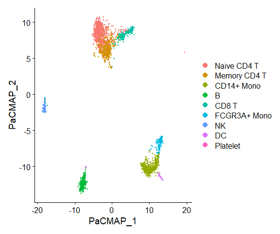
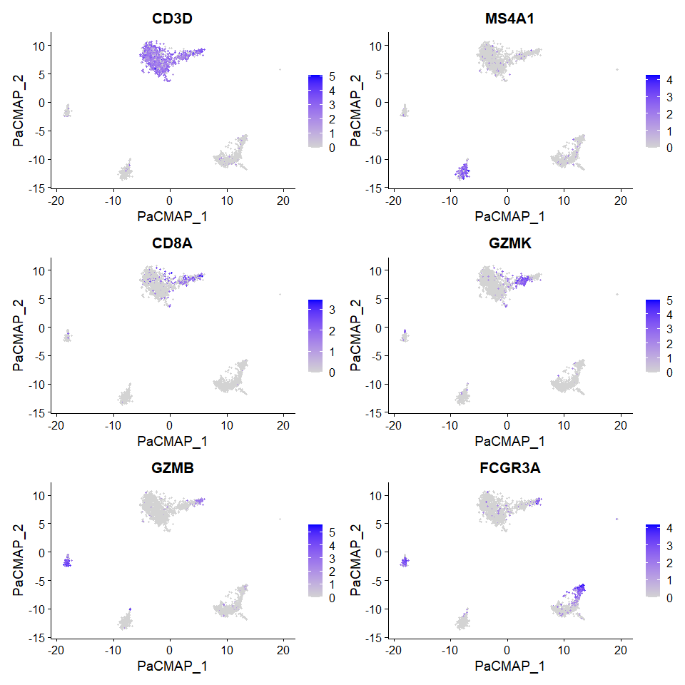
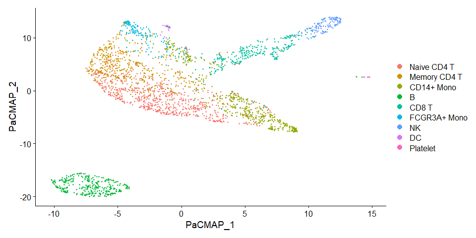

Running PaCMAP on a Seurat Object
================
Compiled: July 29, 2026

This vignette demonstrates how to run PaCMAP, a dimensionality reduction
method that provides robust and trustworthy visualization, on a Seurat
object. If you use our work, please cite:

> *Understanding How Dimension Reduction Tools Work: An Empirical
> Approach to Deciphering t-SNE, UMAP, TriMap, and PaCMAP for Data
> Visualization*
>
> Yingfan Wang, Haiyang Huang, Cynthia Rudin & Yaron Shaposhnik
>
> Journal of Machine Learning Research, 2021
>
> doi: <https://doi.org/10.48550/arXiv.2012.04456>
>
> *Towards a comprehensive evaluation of dimension reduction methods for
> transcriptomic data visualization*
>
> Haiyang Huang, Yingfan Wang, Cynthia Rudin and Edward P. Browne
>
> Communications biology, 2022
>
> doi: <https://doi.org/10.1038/s42003-022-03628-x>
>
> GitHub: <https://github.com/YingfanWang/PaCMAP>

## Prerequisites

- [Seurat](https://satijalab.org/seurat/install)
- [SeuratWrappers](https://github.com/satijalab/seurat-wrappers)
- [SeuratData](https://github.com/satijalab/seurat-data)
- [pacmapr](https://github.com/williamsyy/pacmap-for-R) — native R +
  Rcpp implementation of PaCMAP.

`SeuratWrappers` lists `pacmapr` under `Remotes:`, so installing
SeuratWrappers via
`remotes::install_github("satijalab/seurat-wrappers")` pulls it in
automatically. To install it directly:

``` r
# install.packages("remotes")
remotes::install_github("williamsyy/pacmap-for-R", subdir = "pacmapr")
```

No Python, conda, or `reticulate` installation is required — everything
runs natively in R via C++.

``` r
library(Seurat)
library(SeuratData)
library(SeuratWrappers)
```

### PaCMAP on PBMC3k

To learn more about this dataset, type `?pbmc3k`.

``` r
InstallData("pbmc3k")
pbmc3k.final <- LoadData("pbmc3k", type = "pbmc3k.final")

# Initial processing to select variable features
pbmc3k.final <- UpdateSeuratObject(pbmc3k.final)
pbmc3k.final <- FindVariableFeatures(pbmc3k.final)

# Run PaCMAP on the Seurat object (native R backend via pacmapr).
pbmc3k.final <- RunPaCMAP(
  object   = pbmc3k.final,
  features = VariableFeatures(pbmc3k.final)
)
```

    ## Iteration: 1, Loss: 32495.2
    ## Iteration: 25, Loss: 22156
    ## Iteration: 50, Loss: 19689.9
    ## Iteration: 75, Loss: 17166.1
    ## Iteration: 100, Loss: 12422.3
    ## Iteration: 125, Loss: 14797.6
    ## Iteration: 150, Loss: 14785.6
    ## Iteration: 175, Loss: 14784.2
    ## Iteration: 200, Loss: 14784.3
    ## Iteration: 225, Loss: 7309.23
    ## Iteration: 250, Loss: 7216.05
    ## Iteration: 275, Loss: 7185.6
    ## Iteration: 300, Loss: 7168.03
    ## Iteration: 325, Loss: 7155.28
    ## Iteration: 350, Loss: 7145.62
    ## Iteration: 375, Loss: 7137.84
    ## Iteration: 400, Loss: 7131.49
    ## Iteration: 425, Loss: 7126.24
    ## Iteration: 450, Loss: 7121.76

``` r
features.plot <- c("CD3D", "MS4A1", "CD8A", "GZMK", "GZMB", "FCGR3A")
DimPlot(object = pbmc3k.final, reduction = "pacmap")
```

<!-- -->

``` r
pbmc3k.final <- NormalizeData(pbmc3k.final, verbose = FALSE)
FeaturePlot(pbmc3k.final, features.plot, ncol = 2, reduction = "pacmap")
```

<!-- -->

You can also specify dims of an existing reduction (e.g. PCA) as input
to PaCMAP:

``` r
pbmc3k.final <- RunPaCMAP(object = pbmc3k.final, dims = 2:5)
```

    ## Iteration: 1, Loss: 32495.2
    ## Iteration: 25, Loss: 21026.4
    ## Iteration: 50, Loss: 18235.5
    ## Iteration: 75, Loss: 15420.2
    ## Iteration: 100, Loss: 9993.91
    ## Iteration: 125, Loss: 12064.6
    ## Iteration: 150, Loss: 12002.4
    ## Iteration: 175, Loss: 11990.3
    ## Iteration: 200, Loss: 11987.9
    ## Iteration: 225, Loss: 5229.77
    ## Iteration: 250, Loss: 5188.8
    ## Iteration: 275, Loss: 5173.59
    ## Iteration: 300, Loss: 5165.47
    ## Iteration: 325, Loss: 5160.04
    ## Iteration: 350, Loss: 5156.06
    ## Iteration: 375, Loss: 5152.73
    ## Iteration: 400, Loss: 5149.92
    ## Iteration: 425, Loss: 5147.64
    ## Iteration: 450, Loss: 5145.75

``` r
DimPlot(object = pbmc3k.final, reduction = "pacmap")
```

<!-- -->

### Notes on defaults

The wrapper defaults mirror the reference Python PaCMAP:

- `num_iters = 250L` — expands inside `pacmapr` to `c(100, 100, 250)` =
  450 total optimisation iterations.
- `n.neighbors = NULL` — auto-selected: 10 for `n <= 10 000`, otherwise
  `round(10 + 15 * (log10(n) - 4))`.
- `distance_method = "euclidean"`, `MN_ratio = 0.5`, `FP_ratio = 2`.
- `apply_pca = TRUE` — PaCMAP applies PCA-to-100 preprocessing when the
  input has more than 100 features.
- `init = "random"`; pass `"pca"` or a numeric initial-embedding matrix
  if you prefer.
- `n_threads = NULL` — uses `parallel::detectCores() - 1L`. Set to `1L`
  for a fully single-threaded run.
